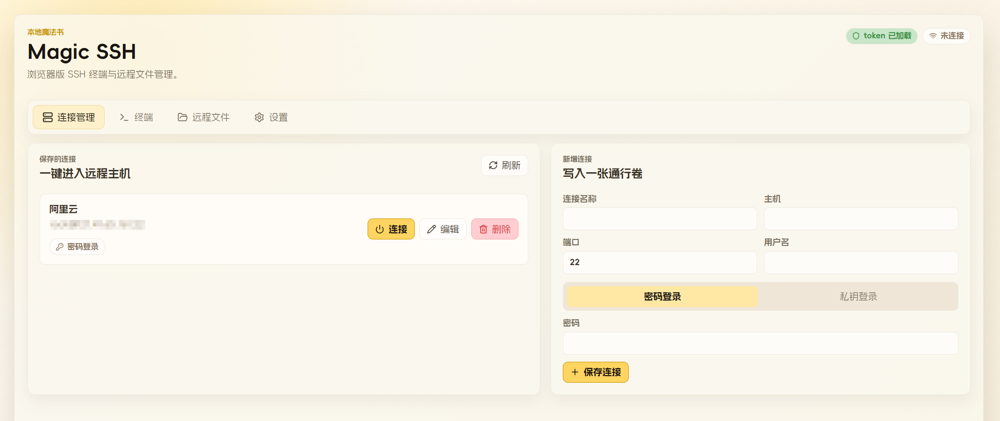
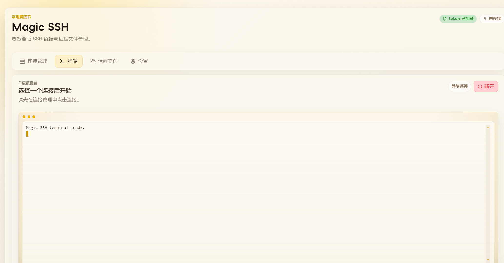

# Magic SSH

一个本地网页服务版的 SSH 工具，支持在浏览器中连接远程 Linux 服务器或开放 SSH 端口的设备，并提供终端与远程文件管理能力。

## 功能

- 浏览器 SSH 终端
- 连接信息本地持久化保存
- 密码登录与私钥登录
- 远程文件浏览
- 远程文件上传与下载
- 启动时选择监听 `127.0.0.1` 或 `0.0.0.0`
- 本地数据保存在程序目录下的 `data/`

## 界面预览

连接管理：



终端界面：



## 技术栈

- Node.js
- Express
- React
- Vite
- xterm.js
- ssh2

## 启动

安装依赖：

```bash
npm install
```

启动服务：

```bash
npm start
```

启动时会提示选择监听地址：

- `127.0.0.1`：仅本机访问
- `0.0.0.0`：允许局域网访问

程序启动后会输出带 token 的访问链接。

## 数据目录

程序会在项目目录下使用 `data/` 保存本地数据，包括：

- 已保存连接
- 加密凭据
- 本地密钥文件

这些内容默认不会提交到 Git 仓库。

## 测试与构建

运行测试：

```bash
npm test
```

构建前端：

```bash
npm run build
```

## Docker 本地构建

项目已包含 `Dockerfile` 和 `docker-compose.yml`，可以直接在项目根目录构建并启动。

使用 Dockerfile 构建镜像：

```bash
docker build -t magic-ssh:local .
```

使用 Docker Compose 构建并后台启动：

```bash
docker compose up -d --build
```

查看启动日志，获取带 token 的访问链接：

```bash
docker logs magic-ssh
```

默认端口映射为：

```text
宿主机 8766 -> 容器 8766
```

浏览器打开日志中输出的链接即可访问。

停止服务：

```bash
docker compose down
```

## Docker 数据持久化

`docker-compose.yml` 默认将项目目录下的 `data/` 挂载到容器内：

```text
./data:/app/data
```

保存的连接信息、加密凭据等数据会保留在本地 `data/` 目录中。该目录已被 `.gitignore` 和 `.dockerignore` 忽略，不会提交到 Git，也不会进入镜像构建上下文。

容器运行时默认环境变量：

```text
LISTEN_HOST=0.0.0.0
PORT=8766
DISABLE_OPEN_BROWSER=1
```

## 说明

这是一个个人自用取向的本地工具，默认优先本机使用。若选择 `0.0.0.0` 监听，请仅在可信网络环境中使用，并妥善保管启动链接中的 token。
